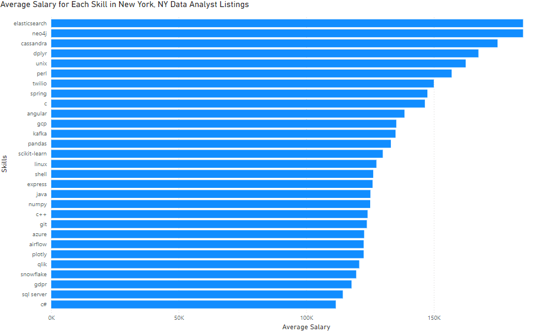

# Introduction
Focusing on Data Analyst roles in New York, NY, this project explores top-paying jobs, in-demand skills, and where high demand meets high salary in data analytics.

Check out the SQL querys I used here: [project_sql folder](/project_sql/)
# Background
This project uses data taken from the SQL Course of [Luke Barousse](https://lukebarousse.com/sql). It comes from a quest to navigate the data analyst job market more effectively by streamlining others work to find optimal jobs.

It's packed with insights on job titles, salaries, locations, and essential skills.
# Tools I Used
For my deep dive into the data analyst job market, I harnessed the power of several key tools:

- **SQL:** The backbone of my analysis, allowing me to query the database and unearth critical insights.
- **PostgreSQL:** The chosen database management system, ideal for handling the job posting data.
- **Visual Studio Code:** My go-to for database management and executing SQL queries.
- **Git & GitHub:** Essential for version control and sharing my SQL scripts and analysis, ensuring collaboration and project tracking.
# The Analysis
Each query for this project aimed at investigating specific aspects of the data analyst job market. Here’s how I approached each question:

### 1. Top Paying Data Analyst Jobs
To identify the highest-paying roles, I filtered data analyst positions by average yearly salary and location, focusing on remote jobs. This query highlights the high paying opportunities in the field.

```sql
SELECT
job_postings_fact.job_id,
job_postings_fact.job_title,
job_postings_fact.job_location,
job_postings_fact.job_schedule_type,
job_postings_fact.salary_year_avg,
job_postings_fact.job_posted_date,
company_dim.name
FROM
job_postings_fact
LEFT JOIN company_dim ON
job_postings_fact.company_id = company_dim.company_id
WHERE job_title_short = 'Data Analyst' AND 
job_location = 'New York, NY' AND 
salary_year_avg IS NOT NULL
ORDER BY salary_year_avg DESC
LIMIT 50
```

**Key Insights from the Data**:

- **Top Salaries**:
The highest-paying job is offered by Coda Search│Staffing for a Data Sector Analyst role at a hedge fund, with an average annual salary of $240,000.
The second-highest salaries are tied at approximately $239,777.5, both for roles at TikTok as Investigations and Insights Lead Data Analysts.

- **Industry Representation**:
Finance and Hedge Funds dominate the higher salary brackets, emphasizing the premium placed on data analysis in these sectors.
Tech Companies like TikTok and Meta also offer competitive salaries.

- **Consistency Across Roles**:
TikTok appears multiple times in the list with high-paying roles, showing a strong investment in data-driven decision-making.

- **Salary Range**:
Top 10 salaries range from $180,000 to $240,000, showcasing a premium for niche expertise in sectors like finance, tech, and compliance.
Job Schedule:

All top-paying roles are full-time, reflecting the demand for dedicated expertise in these fields.


*Bar graph visualizing the salary for the top 8 salaries for data analysts; ChatGPT generated this graph from my SQL query results*

### 2. Skills for Top Paying Jobs
To understand what skills are required for the top-paying jobs, I joined the job postings with the skills data, providing insights into what employers value for high-compensation roles.
```sql
WITH top_skills AS
    (SELECT
    job_postings_fact.job_id,
    job_postings_fact.job_title,
    job_postings_fact.salary_year_avg,
    company_dim.name
    FROM
    job_postings_fact
    LEFT JOIN company_dim ON
    job_postings_fact.company_id = company_dim.company_id
    WHERE job_title_short = 'Data Analyst' AND 
    job_location = 'New York, NY' AND 
    salary_year_avg IS NOT NULL
    ORDER BY salary_year_avg DESC
    LIMIT 25
    )

SELECT
    top_skills.*,
    skills
FROM top_skills
INNER JOIN skills_job_dim ON top_skills.job_id = skills_job_dim.job_id
INNER JOIN skills_dim ON skills_job_dim.skill_id = skills_dim.skill_id
ORDER BY
    salary_year_avg DESC;
```
**Key Insights From the Data**:

- **Top Skills**:
SQL and Data Analysis are the most frequently required skills, indicating their foundational importance in data analyst roles. Python, Excel, and Statistics also rank highly, showing their widespread application in data analysis tasks.

- **Visualization Tools**:
Tools like Tableau and Power BI are frequently mentioned, underscoring the demand for proficiency in presenting data insights visually.

- **Emerging Skills**:
Machine Learning and Cloud Computing are becoming increasingly relevant, reflecting the integration of advanced analytics and cloud-based solutions in data analysis.

- **Soft Skills**:
Skills such as Communication Skills, Problem Solving, and Critical Thinking are crucial, highlighting the importance of conveying insights and solving business problems effectively.


*Bar graph visualizing the count of skills for the top 25 paying jobs for data analysts; ChatGPT generated this graph from my SQL query results*

### 3. In-Demand Skills for Data Analysts

This query helped identify the skills most frequently requested in job postings, directing focus to areas with high demand.

```sql
SELECT 
    skills,
    COUNT(skills_job_dim.job_id) AS demand_count
FROM job_postings_fact
INNER JOIN skills_job_dim ON job_postings_fact.job_id = skills_job_dim.job_id
INNER JOIN skills_dim ON skills_job_dim.skill_id = skills_dim.skill_id
WHERE
    job_title_short = 'Data Analyst' AND
    job_location = 'New York, NY'
GROUP BY
    skills
ORDER BY
    demand_count DESC
LIMIT 10 
```
Here's the breakdown of the most demanded skills for data analysts in 2023
- **SQL** and **Excel** remain fundamental, emphasizing the need for strong foundational skills in data processing and spreadsheet manipulation.
- **Programming** and **Visualization Tools** like **Python**, **Tableau**, and **Power BI** are essential, pointing towards the increasing importance of technical skills in data storytelling and decision support.


*Bar graph visualizing the demand of skills for the NYC Data Analyst jobs; I made this visualization in PowerBI using CSV data generated from my SQL query results*

### 4. Skills Based on Salary
Exploring the average salaries associated with different skills revealed which skills are the highest paying.
```sql
SELECT 
    skills,
    ROUND(AVG(salary_year_avg),0) AS average_salary
FROM job_postings_fact
INNER JOIN skills_job_dim ON job_postings_fact.job_id = skills_job_dim.job_id
INNER JOIN skills_dim ON skills_job_dim.skill_id = skills_dim.skill_id
WHERE
    job_title_short = 'Data Analyst' AND
    job_location = 'New York, NY' AND
    salary_year_avg IS NOT NULL
GROUP BY
    skills
ORDER BY
    AVG(salary_year_avg) DESC
LIMIT 50
```
**Key Observations**:

- **Cloud and Big Data Skills**: Cloud-related tools like GCP ($135,294), Azure ($122,692), and AWS ($106,888) are well-compensated, demonstrating the importance of cloud computing in data analytics.
Big data tools such as Kafka ($135,000) and Spark ($105,242) highlight the demand for distributed data processing expertise.

- **Data Visualization and Analytics Tools**: Skills like Tableau ($100,030), Qlik ($120,763), and Looker ($111,020) indicate that data storytelling and visualization remain critical but are not among the top-paying skills.
Plotly ($122,500) is a standout among visualization libraries, suggesting increased demand for interactive, code-based visualizations.

- **Popular Generalist Tools and Frameworks**:
Python ($110,396) and its related libraries like Pandas ($133,169) and Numpy ($125,062) are well-paid, highlighting their versatility across roles.
Generalist frameworks like Java ($125,147) and Angular ($138,516) indicate demand for integration between analytics and application development.

- **Database and Query Skills**:
SQL remains the backbone for most data roles, with SQL Server ($114,327) and MySQL ($99,500) being well-paid.
Tools like Snowflake ($119,577) and MongoDB ($100,000) reflect increasing demand for modern data warehousing and NoSQL solutions.


*Bar graph visualizing the average salary associated with each skill for NYC Data Analyst jobs; I made this visualization in PowerBI using CSV data generated from my SQL query results*

### 5. Most Optimal Skills to Learn

Combining insights from demand and salary data, this query aimed to pinpoint skills that are both in high demand and have high salaries, offering a strategic focus for skill development.

```sql
WITH skills_demand AS (
        SELECT 
        skills_dim.skill_id,
        skills_dim.skills,
        COUNT(skills_job_dim.job_id) AS demand_count
    FROM job_postings_fact
    INNER JOIN skills_job_dim ON job_postings_fact.job_id = skills_job_dim.job_id
    INNER JOIN skills_dim ON skills_job_dim.skill_id = skills_dim.skill_id
    WHERE
        job_title_short = 'Data Analyst' AND
        job_location = 'New York, NY' AND
        salary_year_avg IS NOT NULL
    GROUP BY
        skills_dim.skill_id
    ), skills_avg_salary AS (
        SELECT 
        skills_dim.skill_id,
        ROUND(AVG(salary_year_avg),0) as avg_salary
    FROM job_postings_fact
    INNER JOIN skills_job_dim ON job_postings_fact.job_id = skills_job_dim.job_id
    INNER JOIN skills_dim ON skills_job_dim.skill_id = skills_dim.skill_id
    WHERE
        job_title_short = 'Data Analyst' AND
        job_location = 'New York, NY' AND
        salary_year_avg IS NOT NULL
    GROUP BY
        skills_dim.skill_id
    )

SELECT
    skills_demand.skill_id,
    skills_demand.skills,
    demand_count,
    avg_salary
FROM
    skills_demand
INNER JOIN skills_avg_salary ON skills_demand.skill_id = skills_avg_salary.skill_id
WHERE
    demand_count > 10
ORDER BY
    avg_salary DESC,
    demand_count DESC
LIMIT 25
```
**Actionable Recommendations for Job Seekers**:

- **Learn Core Skills First**:
Prioritize SQL and Python, as they have high demand and versatility.
Add Excel to your skillset, as it is foundational and often used for reporting and quick analysis.

- **Invest in Visualization**:
Tableau and Power BI are essential for communicating insights effectively, making them key tools for data analysts.

- **Specialize in Cloud and Modern Tools**:
Learning Azure, Snowflake, and AWS can significantly boost earning potential and align you with industry trends.

- **Consider Niche Skills for High Salaries**:
Explore Express, Looker, or SQL Server to target roles that offer specialized but lucrative opportunities.

- **Supplement with General Productivity Tools**:
Familiarity with PowerPoint, Word, and SharePoint can enhance communication and collaboration in professional settings.


*Bar graph visualizing both the average salary, denoted by the blue bars, and the demand, denoted by the blue line, associated with each skill for the NYC Data Analyst jobs. I set a minimum of 10 job postings to elimitate outlier skills. I made this visualization in PowerBI using CSV data generated from my SQL query results*

# What I Learned

From working on this project, I've learned many important basic and advanced SQL skills:

- **🧩 Complex Query Crafting:** Mastered the art of advanced SQL, merging tables and wielding WITH clauses to make temporary results sets.
- **📊 Data Aggregation:** Used GROUP BY and aggregate functions like COUNT() and AVG() to find key insights in the data.
- **💡 Analytical Wizardry:** Leveled up my real-world puzzle-solving skills, turning questions into actionable, insightful SQL queries.

# Conclusions

### Insights
From the analysis, several general insights emerged:

1. **Top-Paying Data Analyst Jobs**: The highest-paying jobs for data analysts that allow remote work offer a wide range of salaries, the highest at $650,000!
2. **Skills for Top-Paying Jobs**: High-paying data analyst jobs require advanced proficiency in SQL, suggesting it’s a critical skill for earning a top salary.
3. **Most In-Demand Skills**: SQL is also the most demanded skill in the data analyst job market, thus making it essential for job seekers.
4. **Skills with Higher Salaries**: Specialized skills, such as SVN and Solidity, are associated with the highest average salaries, indicating a premium on niche expertise.
5. **Optimal Skills for Job Market Value**: SQL leads in demand and offers for a high average salary, positioning it as one of the most optimal skills for data analysts to learn to maximize their market value.

### Closing Thoughts
This project enhanced my SQL skills and provided valuable insights into the data analyst job market. The findings from the analysis serve as a guide to prioritizing skill development and job search efforts. Aspiring data analysts can better position themselves in a competitive job market by focusing on high-demand, high-salary skills. This exploration highlights the importance of continuous learning and adaptation to emerging trends in the field of data analytics.